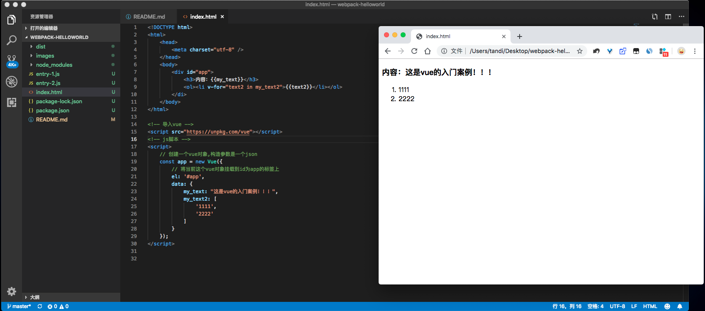
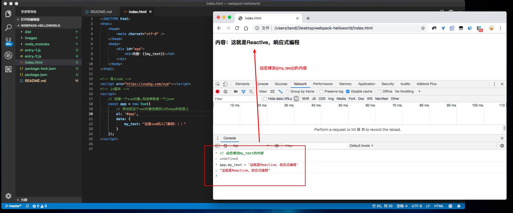
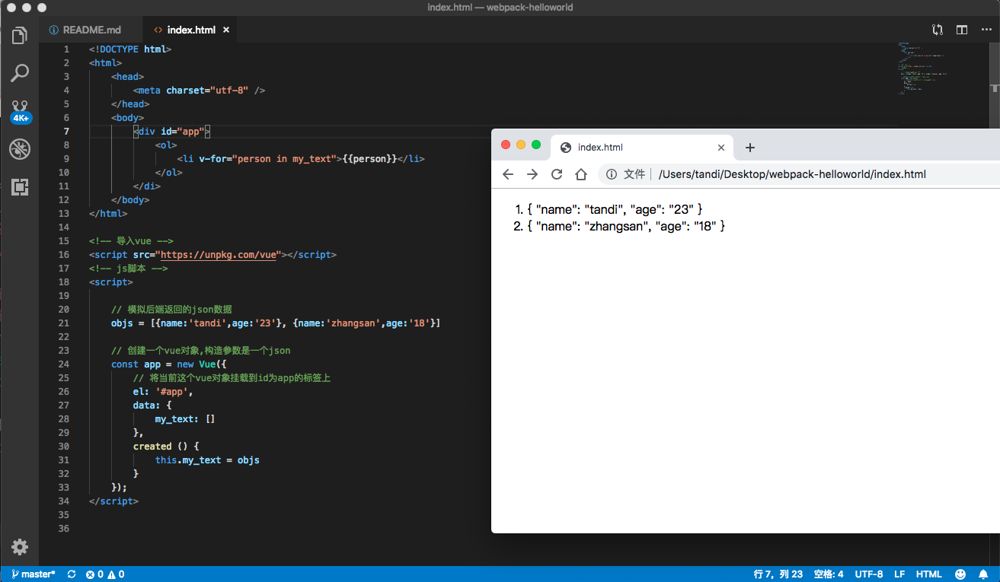
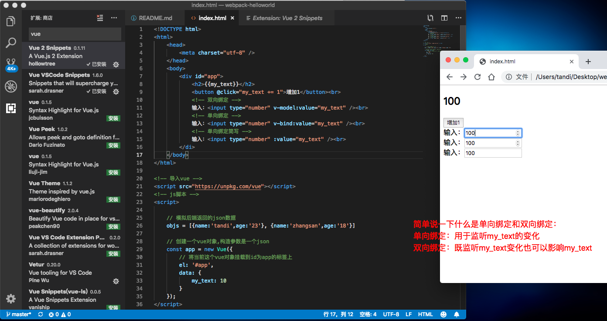

## 作为一个后端开发者，为什么要学习前端？
1. 面试有用
2. 小公司工作可能分工并不明确，有用
3. 平时做做例子验证，可能有用
4. 在这个瞬息万变的行业，我自己认为应该秉持着一种虚心谦卑的态度，保持学习和了解新事物是最基本的事情

## 说明
1. 本文章只对webpack和vue作基本的介绍
2. 文章源码位于[https://github.com/tandi960505/webpack-helloworld](https://github.com/tandi960505/webpack-helloworld)


## Node.js
### 安装node
[Node.js下载地址](https://nodejs.org/zh-cn/)

### 什么是npm？
1. npm全称是NodeJs Package Manager，即node的包管理工具
2. 在安装node时，会有相关npm的安装选项，即npm嵌套在node安装包内，无需额外下载

## Webpack
### 什么是webpack？
1. webpack是一个前端资源的打包工具，它可通过进行静态分析来分析模块之间的依赖关系，然后将其按照指定的规则打包成静态文件；举个简单的例子，如Vue是不能直接被浏览器访问的，这时就需要使用webpack将其打包成静态资源文件来让浏览器访问
2. webpack需要node的环境来支持，所以使用webpack时应该先安装node

### 安装webpack
1. 在github中创建一个新的库，并使用git将其clone下来
2. 进入文件夹,使用`npm init`将其初始化为node项目
3. 使用`npm i --save-dev webpack`命令安装webpack模块，并将webpack模块的版本信息保存到package.json的devDependencies属性中去(注意：本例子使用局部安装webpack模块，若想全局安装则添加-g参数)

### webpack的基本使用
1. 创建两个用于webpack打包测试用的js文件，如下：
    ```
    echo 'document.write("11111");' > entry-1.js
    echo 'document.write("22222");' > entry-2.js
    ```
2. 执行命令`node_modules/.bin/webpack entry-1.js entry-2.js`将两个js文件打包（注意：如果是第一次执行，会提示需要安装webpack的脚手架，输入yes即可）
3. 执行命令后将会看到生成了文件`dist/main.js`，这就是webpack打包出来的文件，main.js中包含了webpack的一些配置，和entry-1.js、entry-2.js的内容


## Vue
### 什么是vue？
1. vue是一个JavaScript的渐进式框架，同时也是一个响应式框架，使用JavaScript的ES6语法
2. 何为渐进式？简单来说就是你可以将部分vue代码嵌入到现有的非vue项目中去，而不是用了vue框架就一定要用vue范围的功能，所以用了vue也不会影响其他的js框架使用；所以这概念类似于可插拔，个人认为可以将vue简单理解为是一个可插拔的响应式js框架
3. vue的优点在于可以很好的构建一个单页面应用，所以对于目前为什么vue这么流行也归根于前后端分离的架构；所以换个方位来思考，vue可以利用其自身的功能特性来分摊后端的功能职责，即可以将原本在后端处理的逻辑功能提到前端来完成，从而减轻后端的压力
4. vue可以将页面代码分割，将其抽象成可复用的组件（每个组件都包含各自的css/html/javascript）

### 快速入门案例
使用

响应式

获取其他地方的数据来展示

简答的交互



